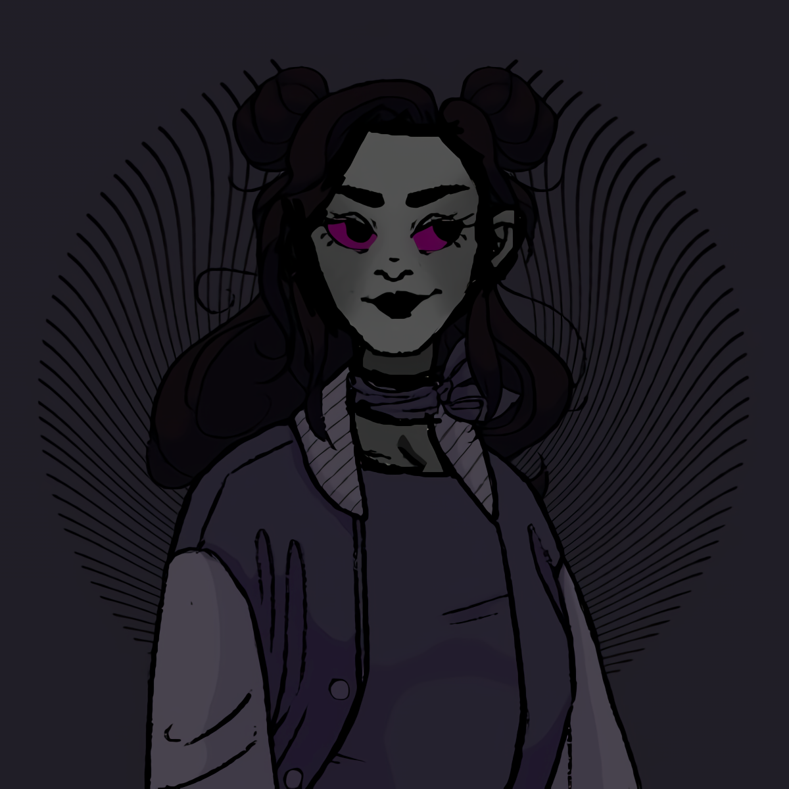

import Helmet from 'react-helmet'

<Helmet
    bodyAttributes={{
        class: 'runeguy'
    }}
/>

<Container>
    
<Banner>

# RuneGuy
#### AKA [Runeer, RanG, DARKrune]

## Who?
RuneGuy is a OG artist friend from a long time ago.

## Why?
RuneGuy has created Starphee OC fan art.

<Container className="small-pic">

</Container>

</Banner>

</Container>