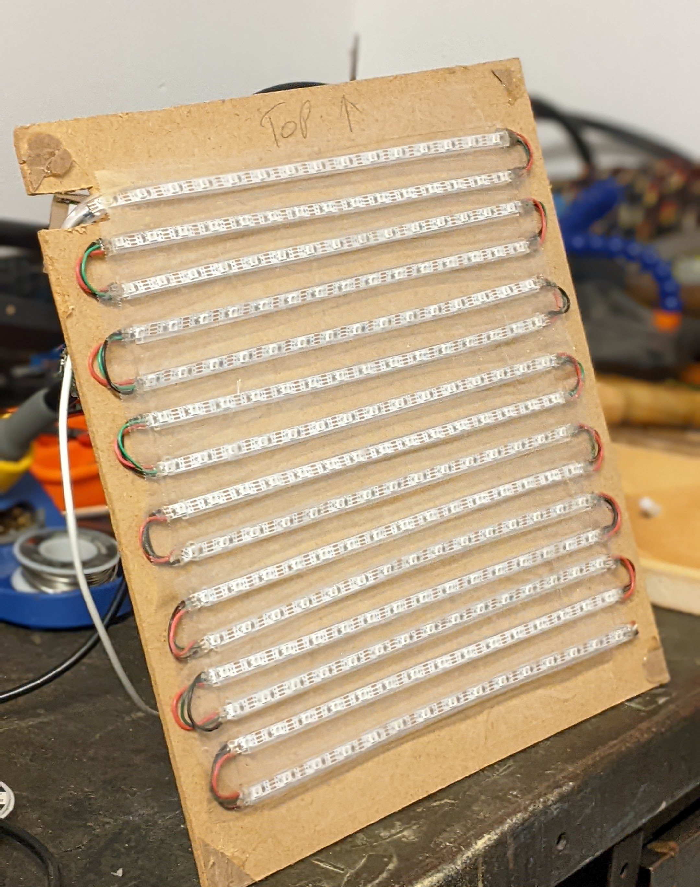
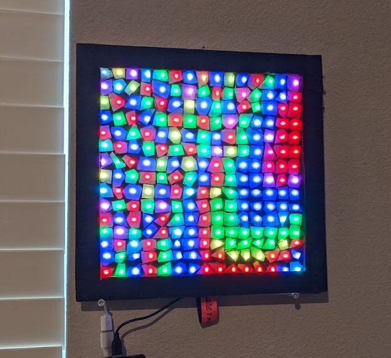
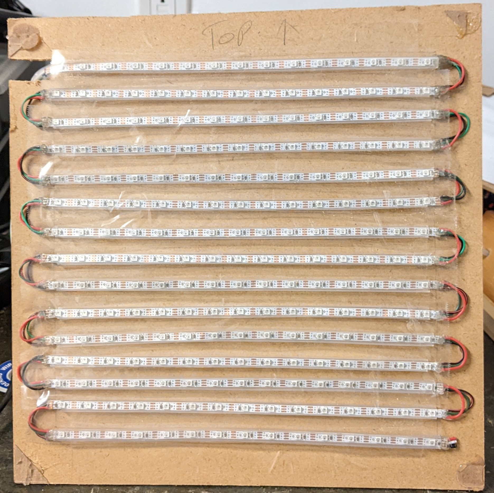
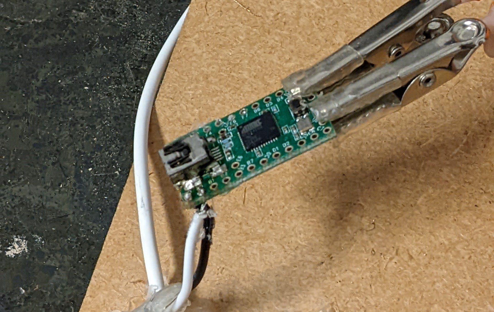
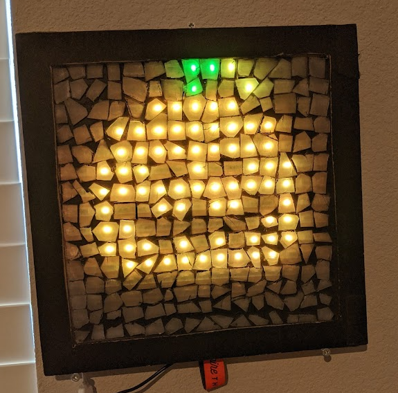

<Container>

<Banner>

# Digital Mosaic
##### A 15x15 matrix grid of LEDs, Created in colaboration with Techninja

</Banner>

#### What is a Digital mosaic?
A digital mosaic is a low fidelity screen, ex; 15x15 pixels which is made up of small shards to give the effect of a mosaic. A mosiac is simply colored peices of glass, tile, ect. which make up an image. With this, you can make each tile an individual color and create images.



Using _Canvas_ we are able display anything on this screen, from clocks, to GIFs, to even screen sharing live. In fact, anything that fits onto a 15x15 canvas can be displayed, and at 60fps!

```
const { createCanvas, loadImage } = require("canvas");
const SerialPort = require("serialport");
const { exec } = require("child_process");
const options = {
  port: "COM5",
  baudRate: 115200,
};

const END_FRAME = 255;
const FRAME_RATE = 60; // In Frame updates per second
const width = 15;
const height = 15;
let brightFrame = null;
const serverPort = 80;
const canvas = createCanvas(width, height);
const ctx = canvas.getContext("2d", { antialias: "none" });

const appData = {
  images: {
    heart: { fps: 3 },
    bird: { fps: 6 },
    eye: { fps: 10 },
    flower: { fps: 2 },
    rainbow: { fps: 24 },
    fire: { fps: 8 },
    pumpkin: { fps: 8 },
    skeleton: { fps: 8 },
    pickaxe: { fps: 5 },
    nyan: { fps: 5 },
    maker: { fps: 8 },
  },
};

```

For example, when working on making examples, we created a randomised rainbow plasma effect, with trillions of combinations. Each one runs at 60fps and can be mesmorising to look at.



---

#### Creating the Mosiac

When we started, it was for a school project! The task was to make a mosaic style art peice and to be creative about it. I thought it would be boring if it was just one image, so I made it infinite images!

To start, we researched some adressible multicolor LED strips that would work for the job, We found the Adafruit Neopixel LED strips were more than adequate and provided all criteria needed.



Then we started development on the LED display. Using a Teensy &amp; Raspberry Pi we eventually we had a rough grid of LEDs that worked and displayed stuff.





---

#### What now?

The mosaic project is always improving and with your help! The code is open source and on Github so feel free to experement and make your own changes! As for the mosaic itself, it has made itself comfertable as my new fancy room clock.

<Banner>

<a class="gtm-button" href="https://makerfaire.com/maker/entry/71367/" rel="external">
  Makerfaire 2020 Exibit
</a>
━━
<a class="gtm-button" href="https://github.com/techninja/mosaic-screen" rel="external">
  Github Repository
</a>
━━
<a class="gtm-button" href="https://www.youtube.com/watch?v=WTFL9O1J2mQ" rel="external">
  Video Overview
</a>

</Banner>

</Container>